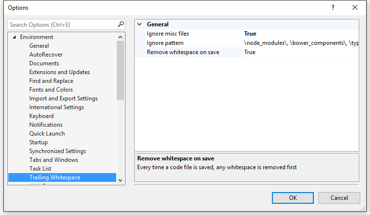

## Trailing Whitespace extension for VS2012/2013/2015

This extension will highlight any trailing whitespace on any line
in any editor in Visual Studio.

Download and install the extension from the
[Visual Studio Gallery](http://visualstudiogallery.msdn.microsoft.com/a204e29b-1778-4dae-affd-209bea658a59)
or get the
[nightly build](https://ci.appveyor.com/project/madskristensen/trailingwhitespace/build/artifacts).

### Remove trailing whitespace
You can very easily delete all the trailing whitespace in a file by executing the **Delete Horizontal White Space** command
found in **Edit** -> **Advanced** or by using the shortcut key combination Ctrl+K, Ctrl+\

### Changing the background color

You can change the background color from the **Tools -> Options** dialog under the **Environment -> Fonts and Colors** settings. The setting is for the *Text Editor* and the display item is called *Trailing Whitespace*.

### Ignore rules
It's easy to add specify what file patterns to ignore. Any
ignored file will have whitespace colorized or removed
on save.

By default, file paths with any of the following strings
contained in it will be ignored:

- \node_modules\
- \bower_components\
- \typings\
- \lib\
- .min.
- .md
- .markdown

You can modify these rules in the **Tools -> Options** dialog.

### Remove on save
Every time a file is saved, all trailing whitespace is removed. This can be disabled in the
**Tools -> Options** dialog.

